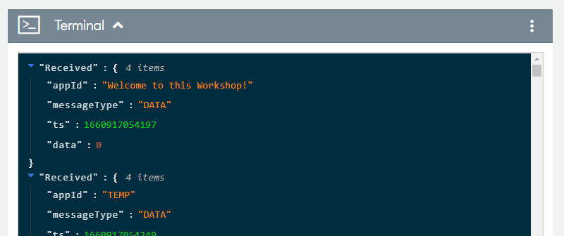
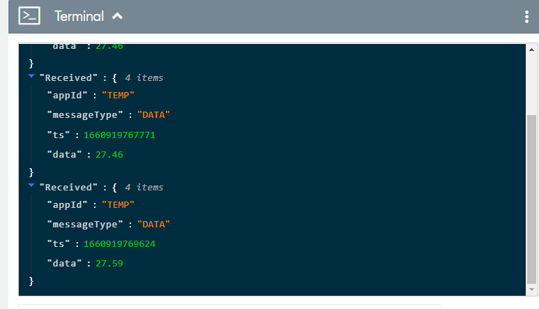

# nRF-Cloud-MQTT-multi-service-Workshop
Workshop based on NCS2.0.0 sample nRF9160: nRF Cloud MQTT multi-service.

This workshop is modified from [Cloud Client nRF91 Workshop](https://github.com/NordicPlayground/ncs-cloud-client-workshop/tree/workshop_with_instructions), which is based on NCS1.9.0 [nRF9160: Cloud client](https://developer.nordicsemi.com/nRF_Connect_SDK/doc/1.9.0/nrf/samples/nrf9160/cloud_client/README.html) sample. This cloud client sample was made to showcase the cloud API but the general cloud API has been removed from NCS2.0.0, so this sample is not avaliable anymore. The cloud API is abandoned due to some reasons. This API made it possible to interchange cloud backends at run time, which is not viable in a real-life application. The cloud API was also difficult to keep generic because of the vast differences between some cloud backends. Nordic wants to encourage users to use the different cloud backend's specific APIs directly and not via a generic layer. It was just too limiting. 

The most similar sample in NCS2.0.0 is [nRF9160: nRF Cloud MQTT multi-service](https://developer.nordicsemi.com/nRF_Connect_SDK/doc/2.0.0/nrf/samples/nrf9160/nrf_cloud_mqtt_multi_service/README.html). It is more complex but has more services like temperature, location and FOTA ready to use. This workshop is based on the nRF Cloud MQTT multi-service sample and adding similar tasks as previous workshop did. 


## Workshop Steps

### Step 1 - Send Welcome message to nRF Cloud
```shell
diff --git a/prj.conf b/prj.conf
index a07c7d5..8b437c2 100644
--- a/prj.conf
+++ b/prj.conf
@@ -50,12 +50,12 @@ CONFIG_STREAM_FLASH_ERASE=y
 CONFIG_LOCATION=y
 CONFIG_LOCATION_METHOD_GNSS=y
 CONFIG_LOCATION_METHOD_CELLULAR=y
-CONFIG_NRF_CLOUD_AGPS=y
+CONFIG_NRF_CLOUD_AGPS=n
 CONFIG_NRF_CLOUD_CELL_POS=y
 CONFIG_MULTICELL_LOCATION_SERVICE_NRF_CLOUD=y
 CONFIG_MODEM_INFO=y
 CONFIG_MODEM_INFO_ADD_NETWORK=y
-CONFIG_NRF_CLOUD_PGPS=y
+CONFIG_NRF_CLOUD_PGPS=n
 CONFIG_NRF_CLOUD_PGPS_REPLACEMENT_THRESHOLD=4
 CONFIG_NRF_CLOUD_PGPS_REQUEST_UPON_INIT=y

diff --git a/src/application.c b/src/application.c
index ff29246..58f13e6 100644
--- a/src/application.c
+++ b/src/application.c
@@ -220,6 +220,8 @@ void main_application(void)
                LOG_WRN("Failed to determine valid date time. Proceeding anyways");
        } else {
                LOG_INF("Current date and time determined");
+               LOG_INF("Welcome to this Workshop! See this message on nRF Cloud Terminal");
+               send_sensor_sample("Welcome to this Workshop!",0);
        }

        /* Begin tracking location at the configured interval. */
```



### Step 2 - Add button press to send temperature message to nRF Cloud 

```shell
diff --git a/Kconfig b/Kconfig
index 79f3c91..7ae10a3 100644
--- a/Kconfig
+++ b/Kconfig
@@ -173,6 +173,12 @@ config TEST_COUNTER

 endmenu

+config CLOUD_PUBLICATION_BUTTON_PRESS
+       bool "Triggers publication to cloud upon a button press"
+        default y
+       help
+         press button to publish temperature message to nRF cloud.
+
 module = MQTT_MULTI_SERVICE
 module-str = MQTT Multi Service
 source "${ZEPHYR_BASE}/subsys/logging/Kconfig.template.log_config"
diff --git a/prj.conf b/prj.conf
index 8b437c2..6363ff3 100644
--- a/prj.conf
+++ b/prj.conf
@@ -85,3 +85,4 @@ CONFIG_FLASH_PAGE_LAYOUT=y
 CONFIG_FLASH_MAP=y
 CONFIG_STREAM_FLASH=y
 CONFIG_MPU_ALLOW_FLASH_WRITE=y
+CONFIG_DK_LIBRARY=y
diff --git a/src/application.c b/src/application.c
index 58f13e6..59a2f96 100644
--- a/src/application.c
+++ b/src/application.c
@@ -19,11 +19,17 @@

 #include "location_tracking.h"

+#include <dk_buttons_and_leds.h>
+
 LOG_MODULE_REGISTER(application, CONFIG_MQTT_MULTI_SERVICE_LOG_LEVEL);

 /* Timer used to time the sensor sampling rate. */
 static K_TIMER_DEFINE(sensor_sample_timer, NULL, NULL);

+#if defined(CONFIG_CLOUD_PUBLICATION_BUTTON_PRESS)
+static struct k_work_delayable cloud_update_work;
+#endif
+
 /**
  * @brief Construct a data device message cJSON object with automatically generated timestamp.
  *
@@ -210,6 +216,30 @@ static void on_location_update(const struct location_data location_data)
        }
 }

+#if defined(CONFIG_CLOUD_PUBLICATION_BUTTON_PRESS)
+static void cloud_update_work_fn(struct k_work *work)
+{
+       if (IS_ENABLED(CONFIG_TEMP_TRACKING)) {
+               double temp = -1;
+               if (get_temperature(&temp) == 0) {
+                       LOG_INF("Temperature is %d degrees C", (int)temp);
+                       (void)send_sensor_sample(NRF_CLOUD_JSON_APPID_VAL_TEMP, temp);
+               }
+       }
+}
+static void work_init(void)
+{
+       k_work_init_delayable(&cloud_update_work, cloud_update_work_fn);
+}
+static void button_handler(uint32_t button_states, uint32_t has_changed)
+{
+       LOG_INF("Button is pressed! Collect and send temperature to nRF Cloud.");
+       if (has_changed & button_states & DK_BTN1_MSK) {
+               k_work_reschedule(&cloud_update_work, K_NO_WAIT);
+       }
+}
+#endif
+
 void main_application(void)
 {
        /* Wait for the date and time to become known.
@@ -224,6 +254,16 @@ void main_application(void)
                send_sensor_sample("Welcome to this Workshop!",0);
        }

+       #if defined(CONFIG_CLOUD_PUBLICATION_BUTTON_PRESS)
+               int err;
+               work_init();
+               LOG_INF("Button is initialized!");
+               err = dk_buttons_init(button_handler);
+               if (err) {
+                       LOG_ERR("dk_buttons_init, error: %d", err);
+               }
+       #endif
+
        /* Begin tracking location at the configured interval. */
        (void)start_location_tracking(on_location_update,
                                        CONFIG_LOCATION_TRACKING_SAMPLE_INTERVAL_SECONDS);
```


### Step 3 - Control the RGB LED on the Thingy91 using the CAF module
### Step 4 - Add commands to turn on and off the LED from the nRF Cloud
### Step 5 - Add a thermostat function
