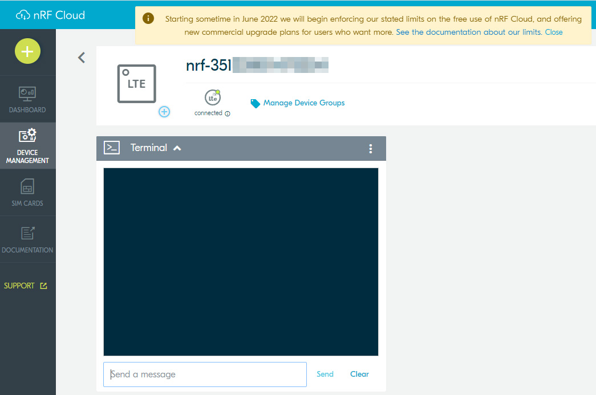

# nRF-Cloud-MQTT-multi-service-Workshop
Workshop based on NCS2.0.0 sample nRF9160: nRF Cloud MQTT multi-service.

This workshop is modified from [Cloud Client nRF91 Workshop](https://github.com/NordicPlayground/ncs-cloud-client-workshop/tree/workshop_with_instructions), which is based on NCS1.9.0 [nRF9160: Cloud client](https://developer.nordicsemi.com/nRF_Connect_SDK/doc/1.9.0/nrf/samples/nrf9160/cloud_client/README.html) sample. This cloud client sample was made to showcase the cloud API but the general cloud API has been removed from NCS2.0.0, so this sample is not avaliable anymore. The cloud API is abandoned due to some reasons. This API made it possible to interchange cloud backends at run time, which is not viable in a real-life application. The cloud API was also difficult to keep generic because of the vast differences between some cloud backends. Nordic wants to encourage users to use the different cloud backend's specific APIs directly and not via a generic layer. It was just too limiting. 

The most similar sample in NCS2.0.0 is [nRF9160: nRF Cloud MQTT multi-service](https://developer.nordicsemi.com/nRF_Connect_SDK/doc/2.0.0/nrf/samples/nrf9160/nrf_cloud_mqtt_multi_service/README.html). It is more complex but demonstrate usage of more services like temperature, location and FOTA. This workshop is based on the nRF Cloud MQTT multi-service sample and adding similar tasks as previous workshop did. 

## HW Requirements
- Thingy91
- nRF9160DK for programming and debugging (or another compatible programmer)
- 10-pin SWD programming cable, like [this one](https://www.adafruit.com/product/1675)
- 2x USB Micro-B cables (one for the Thingy91 and one for the nRF9160DK)

## SW Requirements
- nRF Connect for Desktop
   - Toolchain manager (Windows and Mac only)
   - LTE Link Monitor
- Visual Studio Code (from here on referred to as VSCode)
   - nRF Connect for VSCode extension
- nRF Connect SDK v2.0.0 (installed through the Toolchain manager)

For instructions on how to install these items, please follow the exercise [here](https://academy.nordicsemi.com/topic/exercise-1-1/).

## Workshop Steps
--------------------------------------
### Step 1 - Setting up the original nrf_cloud_mqtt_multi_service sample
-----------------------------------------------

Open [https://nrfcloud.com/](https://nrfcloud.com/), and create a user if you haven't already done so. Make sure you install the SIM card in your Thingy91 and add it to the cloud, as described [here](https://developer.nordicsemi.com/nRF_Connect_SDK/doc/latest/nrf/ug_thingy91_gsg.html#creating-an-nrf-cloud-account).

In VSCode, in the Welcome page of the nRF Connect interface, click on 'Create a new application from sample'.
 Hint: A faster way to do this is to bring up the command palette in VSCode (by pressing F1), typing 'new application', and pressing Enter. 

Ensure that 'Freestanding' application is selected and that the nRF Connect SDK version and selected toolchain is based on v2.0.0. Select the nrf_cloud_mqtt_multi_service sample as a reference, and give the application a new name such as 'nRF-Cloud-MQTT-multi-service-Workshop':


Find the "nRF-Cloud-MQTT-multi-service-Workshop" application in the Applications list, and click on 'Add Build Configuration'. 

Select the board 'thingy91_nrf9160_ns'. Check the 'Enable debug options' box, and click on 'Build Configuration':


Open the build output in the terminal window, and wait for the code to finish building. 

Ensure that the nRF9160DK and the Thingy91 are connected as described [here](https://developer.nordicsemi.com/nRF_Connect_SDK/doc/latest/nrf/ug_thingy91_gsg.html#updating-firmware-through-external-debug-probe). Also make sure they are powered on.

To show log output from the Thingy91 it is necessary to connect to one of two virtual CDC comports enumerated by the Thingy when it is connected over USB. The nRF9160DK will also enumerate various comports, and the easiest way to find out which comport is for log output from the Thingy you can use the LTE Link Monitor app available through nRF Connect for Desktop. Simply connect to the Thingy91 from the LTE Link Monitor, and check which comport the link monitor opens:
   


Close the LTE Link Monitor, and go back to VSCode. Select the nRF Terminal, and click on the 'Start Terminal With New Configuration' button:


When prompted to select connection mode at the top of VSCode, select 'Serial Port'. 
When prompted to select the comport select the comport that was used by the LTE Link Monitor earlier. 
When prompted to choose configuration select '115200 8n1'. 
  
Flash the code into the Thingy91, and ensure that the boot message shows up in the nRF Terminal:


In the build overview in VSCode, expand the 'Application' group and check the Source files and Input files are there.


Modify configurations in Inputfiles->prj.conf to turn off A-GPS and P-GPS, increase sensor and locationg sampling interval to save data and booting time.

Modify folliwing lines:
```C
CONFIG_NRF_CLOUD_AGPS=n
CONFIG_NRF_CLOUD_PGPS=n
```
Add following lines:
```C
CONFIG_SENSOR_SAMPLE_INTERVAL_SECONDS=180
CONFIG_LOCATION_TRACKING_SAMPLE_INTERVAL_SECONDS=300
```


Verify that you can open the device in the nRF Cloud interface, and that you can see the Terminal window



### Step 2 - Send Welcome message to nRF Cloud
--------------------------------------
Add following codes to application.c after line *LOG_INF("Current date and time determined");*:

```C
LOG_INF("Welcome to this Workshop! See this message on nRF Cloud Terminal");
send_sensor_sample("Welcome to this Workshop!",0);
```
Build and flash the code, and verify that you see the following welcome message on nRF Cloud terminal. 


[Commit for this step.](https://github.com/charlieshao5189/nRF-Cloud-MQTT-multi-service-Workshop/commit/14a91cbc35cf10fae08780b6f8c420b9f05b3ba9)

### Step 3 - Add button press to send temperature message to nRF Cloud 
--------------------------------------
Add button press detection to sample.

Add following configuration to be able to enable or disable button press function.

```C
config CLOUD_PUBLICATION_BUTTON_PRESS
	bool "Triggers publication to cloud upon a button press"
        default y
	help
	  press button to publish temperature message to nRF cloud.
```
Add development kit hardware support to prj.conf
```C
CONFIG_DK_LIBRARY=y
```
Add head file for development kit button and led in application.c
```C
#include <dk_buttons_and_leds.h>
```
It is not recommended to run a lot of code directly from an event handler, since event handlers are often running in interrupt context. From interrupt context there are many drivers and libraries that are unavailable (or unsafe to use), and you also risk blocking other interrupts in the system which could lead to system instabilities or crashes. To avoid this issue it is possible to register a work item, which will be triggered from the event handler (by using k_work_submit(..)), but where the actual work function will be run from the thread context. For more information about work queues and work items please refer to the documentation.

To implement this, start by declaring a work function and a work item by adding the following codes.
application.c 
```C
#if defined(CONFIG_CLOUD_PUBLICATION_BUTTON_PRESS)
static struct k_work_delayable cloud_update_work;
#endif
```
Add the cloud update work function before *void main_application(void)*.
```C
void cloud_update_work_fn(struct k_work *work)
{
	if (IS_ENABLED(CONFIG_TEMP_TRACKING)) {
		double temp = -1;
		if (get_temperature(&temp) == 0) {
			LOG_INF("Temperature is %d degrees C", (int)temp);
			(void)send_sensor_sample(NRF_CLOUD_JSON_APPID_VAL_TEMP, temp);
		}
	}
}
static void work_init(void)
{
	k_work_init_delayable(&cloud_update_work, cloud_update_work_fn);
}
static void button_handler(uint32_t button_states, uint32_t has_changed)
{
	LOG_INF("Button is pressed! Collect and send temperature to nRF Cloud.");
	if (has_changed & button_states & DK_BTN1_MSK) {
		k_work_reschedule(&cloud_update_work, K_NO_WAIT);
	}
}
```
Then finish work and button intialization in *main_application* function.
```C
work_init();
LOG_INF("Button is initialized!");
#if defined(CONFIG_CLOUD_PUBLICATION_BUTTON_PRESS)
        int err;
        err = dk_buttons_init(button_handler);
        if (err) {
                LOG_ERR("dk_buttons_init, error: %d", err);
        }
#endif
```

Build and flash the code, press the button and observe that new temperature message appear on nRF Cloud terminal. 


[Commit for this step.](https://github.com/charlieshao5189/nRF-Cloud-MQTT-multi-service-Workshop/commit/1282535ec95c6c290d250985017a870eb41e87cb)

### Step 4 - Add a function to decode messages from the cloud and reply with temperature message
--------------------------------------
In this step a function will be added to decode the messages received from the cloud, and if the {"temp":"read"} command is received a message will be printed to the log, then tempratue will be sampled and sent to nRF Cloud.

Add the following function somewhere above the *cloud_event_handler(const struct nrf_cloud_evt *nrf_cloud_evt)* function in connection.c:

```C
// This function expects a cloud message on the format {"TYPE":"VALUE"}, where TYPE and VALUE are strings
// If TYPE mathces target_type_str, and VALUE matches target_value_str, the function returns true
bool decode_cloud_message(const struct cloud_msg *message, const uint8_t *target_type_str, const uint8_t *target_value_str)
{
	static uint8_t type_string[64];
	static uint8_t value_string[64];
	int type_index = 0, value_index = 0, delimiter_counter = 0;

	// Go through the cloud message looking for the " delimiters, and moving the TYPE and VALUE string into temporary variables
	for(int i = 0; i < message->len; i++) {
		if(message->buf[i] == '\"') delimiter_counter++;
		else {
			switch(delimiter_counter) {
				case 0: break; // Do nothing, still waiting for the first delimiter
				case 1:
					type_string[type_index++] = message->buf[i]; // Copy the type string
					break;
				case 2: break; // Do nothing, waiting for the third delimiter
				case 3:
					// Copy the value string
					value_string[value_index++] = message->buf[i];
					break;
				default: break; // If the delimiter is 4 or more we are at the end of the message
			}
		}
	}
	// Add null termination to the strings
	type_string[type_index] = 0;
	value_string[value_index] = 0;

	// Return true if both the type and value strings match
	return strcmp(type_string, target_type_str) == 0 && strcmp(value_string, target_value_str) == 0;
}
```
Demonstrate that the *decode_cloud_message(..)* function works, by adding the following code inside the *cloud_event_handler(..)* function, inside the *NRF_CLOUD_EVT_RX_DATA* switch case:

```C
// Upon receiving the message {"temp":"read"} from the cloud, initiate a temperature reading
if(decode_cloud_message(&evt->data.msg, "temp", "read")) {
   LOG_INF("Temperature read command received");
}
```
Build and flash the code, and verify that you get the following nRF Terminal output when sending the {"temp":"read"} command from the nRF Cloud:


[Commit for this step.](https://github.com/charlieshao5189/nRF-Cloud-MQTT-multi-service-Workshop/commit/535b58469ad471235e4d435bdf5a2b4f39e50872
)

### Step 5 - Control the RGB LED on the Thingy91 using the CAF module
--------------------------------------

For this step the Common Application Framework (CAF) LED module will be enabled in order to control the RGB LED on the Thingy91. 

Start by adding the following lines to the bottom of prj.conf:
```C
CONFIG_CAF=y
CONFIG_CAF_LEDS=y
CONFIG_PWM=y
CONFIG_LED=y
CONFIG_LED_PWM=y 
```

Add the following include to the top of main.c:
```C
#include <app_event_manager.h>
```

Towards the top of main.c, just below the *LOG_MODULE_REGISTER(cloud_client, CONFIG_CLOUD_CLIENT_LOG_LEVEL);* line, add the following:
```C
#define MODULE main
#include <caf/events/module_state_event.h>
```

The Common Application Framework is based around a module called the Event Manager, which provides a generic event framework for sending status information between different modules in the application. To initialize the event manager add the following code to the main() function in main.c, just below the *LOG_INF("nRF Cloud MQTT multi-service sample has started.");* line:
```C
app_event_manager_init();
module_set_state(MODULE_STATE_READY);
```

Two additional commands will be added to the application, allowing the LED to be turned on or off by sending direct commands from the cloud. 

Add the following include to the top of connection.c:
```C
#include <caf/events/led_event.h>
```

The LED module uses LED events to control the LED, by defining different LED effects that can be run on the LED. These effects make it easy to set the LED to different colors, or to have the LED blink or pulse between two colors automatically. To set up some standard LED effects, and add a function for sending a new LED event to the LED module, add the following code to connection.c, just below the *static int send_failure_count;* line:
```C
// Define various LED effects to be used by the application
const struct led_effect led_effect_red = LED_EFFECT_LED_ON(LED_COLOR(255, 0, 0));
const struct led_effect led_effect_blink_red = LED_EFFECT_LED_BLINK(100, LED_COLOR(255, 0, 0));
const struct led_effect led_effect_pulse_red = LED_EFFECT_LED_BREATH(100, LED_COLOR(255,0,0));
const struct led_effect led_effect_blue = LED_EFFECT_LED_ON(LED_COLOR(0, 0, 255));
const struct led_effect led_effect_blink_blue = LED_EFFECT_LED_BLINK(100, LED_COLOR(0, 0, 255));
const struct led_effect led_effect_pulse_blue = LED_EFFECT_LED_BREATH(100, LED_COLOR(0, 0, 255));
const struct led_effect led_effect_off = LED_EFFECT_LED_OFF();

// This function is used to send LED events to the LED module, in order to set the LED in different states
static void send_led_event(const struct led_effect *effect)
{
	struct led_event *event = new_led_event();

	event->led_id = 0;
	event->led_effect = effect;
	EVENT_SUBMIT(event);
}
```

In order to allow the LED to be controlled from the cloud interface, add the following code at the end of the *NRF_CLOUD_EVT_RX_DATA* case in the *cloud_event_handler(..)* function:
```C
else if(decode_cloud_message(&evt->data.msg, "led", "blink red")) {
	LOG_INF("Setting LED to blink red");
	send_led_event(&led_effect_blink_red);
} else if(decode_cloud_message(&evt->data.msg, "led", "off")) {
	LOG_INF("Turning off LED");
	send_led_event(&led_effect_off);
}
```

Build and flash the code. After the device has connected to the cloud verify that the LED can be controlled by sending the {"led":"blink red"} and {"led":"off"} commands.

[Commit for this step.](https://github.com/charlieshao5189/nRF-Cloud-MQTT-multi-service-Workshop/commit/a1eb7ce9ef0eb542a91539011b4f3756e4354845
)
### Step 6 - Add a thermostat function
--------------------------------------
In order to expand on the functionality introduced in the previous steps, and combine the temperature sensor, LED control and cloud interface elements into one feature, the goal of this step is to implement a simple thermostat function.
A new command should be added introduced allowing a threshold temperature to be configured through the cloud. As an example, if the command {"thermostat":"28"} is set, the threshold should be set to 28 degrees. 
Then whenever the temperature sensor is read the temperature should be compared to the threshold value. If the actual temperature is higher the LED should be set to blink red, and if the temperature is lower it should blink blue. 

This is a free form exercise, and the code needed to complete the step will not be provided. 

### Bonus steps
---------------
In the unlikely event that all the steps above have been completed, with time to spare, here are some suggestions for further improvements
- To save cloud bandwidth, add some code to the *read_temp_work_fn(..)* function to have the function skip the cloud update unless the temperature has changed more than a specific amount (1.0C for instance). 
- Add support for the remaining environment readings supported by the BME680 sensor, such as humidity and air pressur
- Add support to modify the current sampling interval time through nRF Cloud message, it is fixed and configured by CONFIG_SENSOR_SAMPLE_INTERVAL_SECONDS in this example.